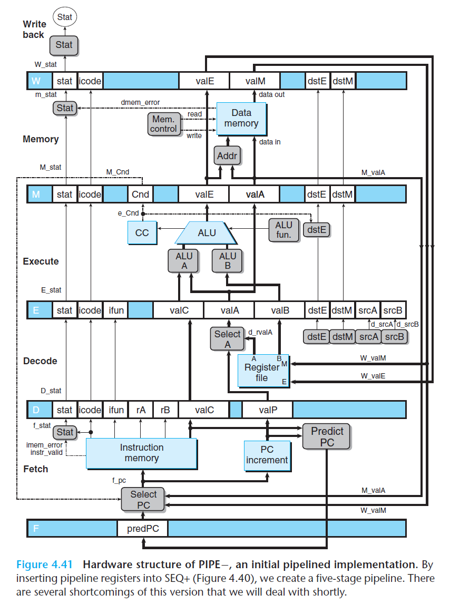

# Ch4 Processor Architecture

## 4.5 Pipelined Y86-64 Implementations

**Inserting Pipeline Registers**

对 SEQ+ 的各个阶段插入流水线寄存以后，对信号进行重新排列，得到 PIPE- 处理器。

如下图，流水线寄存器有不同的标号和不同的作用：

* F，保存了 PC 的预测值；
* D，位于取值和译码阶段之间，保存了最新取的指令，即将提送到执行阶段；
* E，位于译码和执行阶段之间，保存了最新译码的指令和从寄存器文件读出的信息，即将由执行阶段进行处理；
* M，位于执行和访存阶段之间，保存了最新执行的指令的结果，即将由访存阶段进行处理；此外，还保存了用于处理条件转移的分支条件和分支目标的信息；
* W，位于访存阶段和反馈路径之间，反馈路径将计算出来的值提供给寄存器写，完成 `ret` 指令时，向 PC 选择逻辑提供返回地址。

**Rearranging and Relabeling Signals**

* 对 `Stat` 进行新的命名进制，防止使用错误版本的信号，在信号名前面加上流水线寄存器名字作为前缀；
    * 大写前缀，类似于`M, D` ： `M_stat` 指的是流水线寄存器 M 的状态码阶段；
    * 小写前缀，`m, d` ：`m_stat` 指的是访存阶段中由逻辑控制块产生的状态信号；
* 译码阶段产生的 `dstE` 和 `dstM`，指明值 `valE` 和 `valM` 的目的寄存器。在 SEQ+ 中，可以直接将这些信号连接到寄存器文件的地址输入上；在 PIPE- 中，会在流水线中一直携带信号穿过执行和访存阶段，直到写回阶段才送到寄存器文件，这样做为了确保写写端口的地址和数据输入时来自于同一条指令。
* PIPE- 中多了比 SEQ+ 的 `Select A` 的快，为了减少流水线寄存器的状态数量。